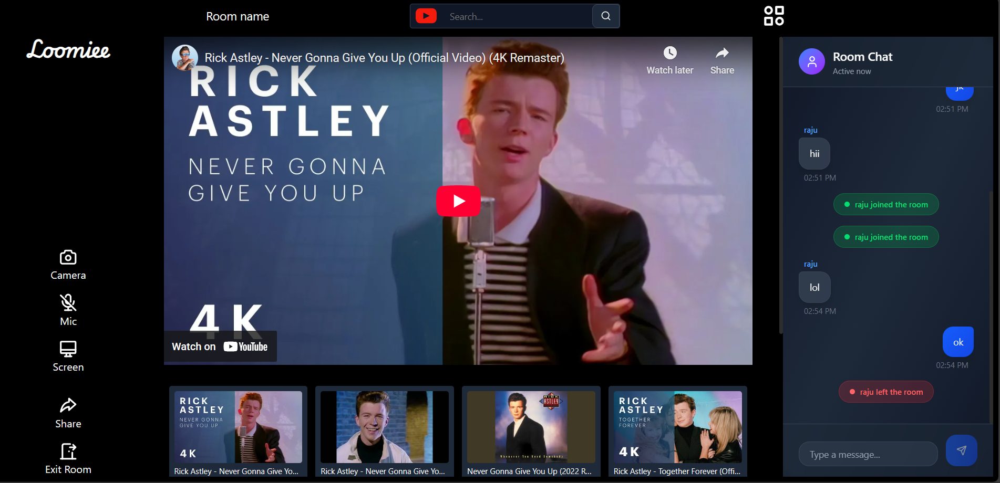

# 🎬 Loomiee – Real-Time Media Sync App

Loomiee is a real-time multi-user media synchronization application where users can join a shared room and watch YouTube videos together with perfectly synced playback. The app also provides a live chat feature for participants to communicate while watching.

---

## 🔗 Repositories
| Component  | Repository Link |
|------------|----------------|
| Frontend   | https://github.com/deep231iw/loomie-frontend.git |
| Backend    | https://github.com/deep231iw/loomie-backend.git |

---

## 🚀 Features
- 🔗 Create or join rooms using a unique Room ID  
- 🎬 Synchronized YouTube video playback (play, pause, seek, change video)  
- 💬 Real-time chat messaging using WebSockets  
- 🔐 Secure authentication using JWT  
- ⚡ Fast, responsive UI built with Vite + React + TailwindCSS  
- 🛠 Backend built with Node.js, Express, Prisma & PostgreSQL  

---

## 🛠 Tech Stack
**Frontend:** React, Vite, TailwindCSS, Socket.io Client, React-YouTube  
**Backend:** Node.js, Express.js, Prisma ORM, PostgreSQL, Socket.io  
**Auth:** JWT, bcrypt  
**Real-time:** WebSockets

---

## 📸 Screenshots

Room View  
*(Add your screenshot image in `/screenshots/room-view.png`)*  



---

## 🧩 Future Improvements
- 🎥 WebRTC-based video and audio calling
- 🖥 Screen sharing
- 📡 SFU media server for scalable group calls
- 👤 User profile, avatars & roles

---

## 🧪 Local Setup

```bash
# clone repos
git clone https://github.com/deep231iw/loomie-frontend.git
git clone https://github.com/deep231iw/loomie-backend.git
